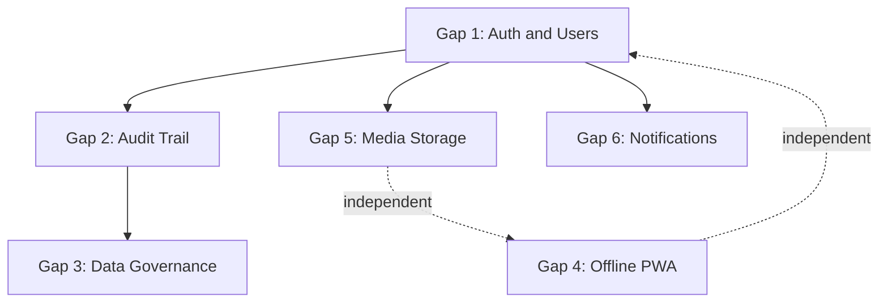

# Wardenspire – Priority Gaps Roadmap

This document identifies the six highest-priority capability gaps between the current Phase 1 codebase and a platform credible enough for first multi-agency engagement. Each gap describes what is missing, why it matters for the product's operational and governance promises, what implementation involves, and which files are affected.

**Context:** Phase 1 (foundational zones) is implemented. See [wardenspire-zone-architecture.md](wardenspire-zone-architecture.md) for the zone model, [implementation-stack.md](implementation-stack.md) for the current stack, and [wardenspire_overview.md](wardenspire_overview.md) for the full product vision.

---

## Dependency overview

Gaps are numbered by priority. The dependency graph determines build order.

- **Auth** is the prerequisite for Audit, Notifications, and Media (all need a real user identity).
- **Audit** should come immediately after Auth so every subsequent feature is logged from day one.
- **Data Governance** depends on Audit (retention, deletion, and SARs all reference the audit log).
- **Offline** and **Media** are independent of each other and can be parallelised once Auth exists.
- **Notifications** requires Auth (to know who to notify) and benefits from Audit events as a trigger source.

---

## Gap 1: Authentication and User Identity

### Why it blocks everything else

RBAC, audit trails, notifications, and tenant isolation all depend on knowing *who* is using the system. Currently `created_by_user_id` on incidents is a free string with no backing entity. The role-based permission model described in the product overview and zone architecture docs cannot be enforced without authenticated user identity.

### What it involves

| Component | Detail |
|-----------|--------|
| **UserModel** | id, name, email, hashed_password, role, tenant_id, assigned_zone_ids (JSON), is_active, created_at, updated_at |
| **Auth endpoints** | Register (admin-invited only), login, token refresh, logout |
| **Session mechanism** | JWT with short-lived access tokens and longer-lived refresh tokens |
| **Auth middleware** | Extracts tenant_id and user context from the token; injects into every request via FastAPI dependency |
| **Password hashing** | bcrypt or argon2 |
| **Future** | OAuth2 / Microsoft Entra integration for council and police SSO; multi-factor authentication |

### Files touched

- **New:** `UserModel` in `backend/app/models.py`; new router `backend/app/routers/auth.py`; auth dependency module (e.g. `backend/app/auth.py`)
- **Changed:** every existing router (`incidents`, `tasks`, `zones`, `incident_categories`) gains an auth dependency; `created_by_user_id` becomes a real foreign key to the users table
- **Frontend:** login page; token storage and refresh logic in `frontend/src/api.ts`; protected route wrapper in `frontend/src/App.tsx`

---

## Gap 2: Audit Trail and Edit History

### Why it matters

The product overview promises "immutable timestamps, entry edit history logged, user ID attribution." Without this the platform has no evidential integrity and cannot be used for police referrals, PSPO enforcement, or council reporting. Every write operation must leave a permanent, tamper-evident record.

### What it involves

| Component | Detail |
|-----------|--------|
| **AuditLogModel** | id, tenant_id, entity_type (incident / task / zone / category), entity_id, action (created / updated / status_changed / deleted), changed_by_user_id, timestamp, previous_values (JSON), new_values (JSON) |
| **Soft deletes** | Add `deleted_at` column to incidents and tasks; never hard-delete operational records |
| **Audit service** | Helper function called by CRUD layer on every create, update, and delete; captures before/after state |
| **Read-only API** | `GET /api/tenants/{id}/audit-log` filtered by entity, date range, user; restricted to admin and police roles |
| **Frontend** | Audit trail panel on the incident detail view showing chronological change history |

### Files touched

- **New:** `AuditLogModel` in `backend/app/models.py`; audit service module (e.g. `backend/app/audit.py`); audit router `backend/app/routers/audit.py`
- **Changed:** incident and task CRUD functions in `backend/app/crud.py` to call audit logger on every write
- **Depends on:** Gap 1 (user identity needed for `changed_by_user_id`)

---

## Gap 3: Data Governance, Retention, and UK GDPR Compliance

### Why it matters

Public-sector procurement requires evidence of lawful data handling before any trial deployment. Councils and police forces will ask for a Data Processing Impact Assessment (DPIA) and data sharing agreement framework. This is primarily a documentation and policy gap, but some backend support is needed to enforce retention.

### What it involves

| Component | Detail |
|-----------|--------|
| **Governance document** | New `docs/data-governance.md` covering: lawful basis for processing (legitimate interests / public task under UK GDPR Article 6); data categories and sensitivity classification; retention periods by entity type (e.g. incidents 2 years, audit logs 7 years, configurable per tenant); subject access request (SAR) handling process; data sharing agreements framework (Ranger org, police, council, BID); DPIA summary |
| **Retention config** | Fields on `TenantModel` for per-entity retention periods |
| **Cleanup job** | Scheduled background task that soft-deletes expired records, then purges them after a secondary retention window |
| **Operational guidance** | Documented guidance on objective, non-identifying language in incident descriptions (training concern, but supported by structured fields over free-text) |

### Files touched

- **New:** `docs/data-governance.md`
- **Changed:** retention config fields on `TenantModel` in `backend/app/models.py`; new background task module for retention enforcement
- **Depends on:** Gap 2 (soft deletes and audit log must exist before retention rules can safely purge records)

---

## Gap 4: Offline PWA Support

### Why it matters

Rangers patrol on foot. Mobile signal in town centres is inconsistent -- car parks, underpasses, building interiors. If incident capture fails without connectivity, the "under 20 seconds" promise breaks and Rangers revert to notebooks. The product overview commits to a PWA-first mobile strategy; that promise currently has no offline capability behind it.

### What it involves

| Component | Detail |
|-----------|--------|
| **Service worker** | Vite PWA plugin (`vite-plugin-pwa`) or manual service worker registration; cache-first for static assets (app shell, CSS, JS) |
| **Offline queue** | IndexedDB-backed queue for incident submissions made while offline |
| **Sync-on-reconnect** | When connectivity returns, queued entries are submitted with their original GPS coordinates and timestamps (captured at time of report, not time of sync) |
| **Conflict handling** | Timestamp-based: offline entries keep their captured time; server accepts backdated `created_at` from trusted clients |
| **Status indicator** | Visual indicator in the PWA showing online/offline state and number of queued entries |
| **Web app manifest** | `public/manifest.json` for Add to Home Screen with app name, icons, theme colour |

### Files touched

- **New:** service worker config; offline queue module in `frontend/src/`; `frontend/public/manifest.json`
- **Changed:** `frontend/src/ReportForm.tsx` to queue locally when offline; `frontend/src/api.ts` to detect connectivity; service worker registration in `frontend/src/main.tsx`
- **Independent of:** Gaps 1--3 (can be built in parallel, though submissions will later need to carry authenticated user tokens)

---

## Gap 5: Media / File Storage

### Why it matters

Photos are primary evidence. The product overview lists "optional media upload (photo/video reference)" and the incident model already has a `media_refs` JSON field, but there is no upload endpoint, no storage backend, and no way to attach or view images anywhere in the platform.

### What it involves

| Component | Detail |
|-----------|--------|
| **Upload endpoint** | `POST /api/tenants/{id}/media` accepting images (JPEG, PNG) and short video clips |
| **Storage backend** | Local disk for development; S3-compatible object store (or Azure Blob) for production, behind a storage abstraction layer so the switch is config-only |
| **MediaModel** | id, tenant_id, incident_id, uploader_user_id, filename, content_type, size_bytes, storage_path, created_at |
| **Validation** | Max 10 MB per file; allowed MIME types only (image/jpeg, image/png, video/mp4) |
| **Thumbnails** | Server-side thumbnail generation for dashboard display (Pillow or similar) |
| **Incident linkage** | `media_refs` on incidents populated with media IDs on upload |
| **Frontend** | Photo capture button in `frontend/src/ReportForm.tsx`; thumbnail gallery in the incident detail panel |
| **Future** | EXIF handling policy (strip for privacy vs. preserve for evidence -- governance decision); virus scanning for uploaded files |

### Files touched

- **New:** `MediaModel` in `backend/app/models.py`; media router `backend/app/routers/media.py`; storage abstraction module (e.g. `backend/app/storage.py`)
- **Changed:** `frontend/src/ReportForm.tsx` (photo capture); incident detail components (thumbnail display)
- **Depends on:** Gap 1 (uploader_user_id must be a real user)

---

## Gap 6: Notification System

### Why it matters

Real-time coordination is a core value proposition. Without notifications, users must manually refresh and check for updates, which means incidents and tasks fall through the cracks. The mobile home screen in the product overview shows a notifications icon, but no architecture or implementation exists for it.

### What it involves

| Component | Detail |
|-----------|--------|
| **Event types** | New incident in your zone; task assigned to you; status change on your incident or task; hotspot threshold alert (V2) |
| **Delivery (phase 1)** | In-app notification feed: simplest to build, no external dependencies |
| **Delivery (future)** | Push notifications via service worker; email digest |
| **NotificationModel** | id, tenant_id, user_id, event_type, entity_type, entity_id, message, is_read, created_at |
| **API** | `GET /api/notifications` (list with unread count); `PATCH /api/notifications/{id}/read`; `POST /api/notifications/mark-all-read` |
| **Frontend** | Notification bell icon with unread badge in the app header; dropdown showing recent notifications; click navigates to the relevant incident or task |
| **RBAC** | Only generate notifications for data the target user is permitted to see (zone-scoped, role-filtered) |

### Files touched

- **New:** `NotificationModel` in `backend/app/models.py`; notification service (e.g. `backend/app/notifications.py`); notification router `backend/app/routers/notifications.py`
- **Changed:** incident and task create/update flows in `backend/app/crud.py` to emit notification events; frontend app header for the notification bell component
- **Depends on:** Gap 1 (must know who to notify and what they are permitted to see)

---

## Deferred gaps (next planning round)

These remain important but are not addressed in this document:

| Gap | Why deferred |
|-----|-------------|
| Incident status workflow / state machine | Can use simple status strings until the core platform is secure and auditable |
| Overlay entity implementation | Conceptual model exists; not blocking operational use |
| Export and PDF case packs | High value, but requires auth and audit to be meaningful |
| Deployment and CI/CD | Local development is sufficient while building core features |
| Multi-tenant data isolation (Postgres RLS) | Application-level filtering is adequate for single-tenant / early multi-tenant use |
| WCAG accessibility audit | Required for public-sector procurement; should be done once the UI stabilises |

---

## How to use this document

1. Work through gaps in dependency order (1 → 2 → 3; 4 can run in parallel; 5 and 6 after 1).
2. Each gap should result in updated architecture docs (zone architecture, implementation stack) reflecting the new capabilities.
3. Once all six gaps are closed, revisit this document and plan the next round from the deferred list.
