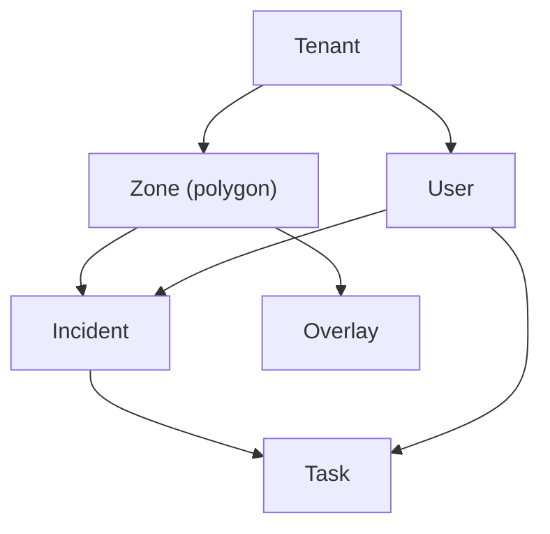

# Wardenspire – Zone Architecture

Implementation-ready documentation of the **Zone Architecture Model** for Wardenspire: how Zones integrate with tenants, incidents, tasks, permissions, and analytics.

**Implementation status:** Phase 1 (foundational zones) is implemented in the current codebase (Python/FastAPI backend, SQLite DB, React/Vite frontend). Phases 2 and 3 are planned.

---

## 1. Context & Positioning

Wardenspire is positioned externally as a **Multi-Agency Operational Intelligence Platform for Town & City Centres**. It supports councils, BIDs, police, and other partners to coordinate operations, log incidents, assign tasks, and use geospatial context to improve town-centre safety and environmental quality.

Internally, the product is framed as a **Multi-Zone Geospatial Operational Intelligence Platform**. This internal model:

- **Supports national scalability**: The same data and permission model works for a single town, a borough with multiple towns, or a future federated regional view. Geography is not hard-coded; it is modelled as configurable Zones.
- **Avoids geographic lock-in**: New areas (transport hubs, campuses, regeneration corridors, event footprints) are added as Zones within a Tenant rather than as one-off features. The product is not constrained to “high street only” use cases.
- **Aligns with multi-town replication**: The existing Multi-Town Replication Model maps naturally onto Zones: each town (or distinct operational area) becomes one or more Zones inside a Tenant.

---

## 2. Zone Concept & Definitions

### What is a Zone?

A **Zone** is a named, configured **geographic polygon** within a **Tenant**. It has:

- **Identity**: Unique id, name, optional description.
- **Geometry**: Polygon (GeoJSON) defining the geographic boundary. MultiPolygon may be added in a future release.
- **Configuration**: Optional time-bounds (`validFrom`, `validTo`), overlay references, and visibility/display settings.
- **Type**: Semantic classification (e.g. primary town centre, secondary high street, hub, event) for reporting and UX.

### Anchoring of operational entities

**All operational entities** are anchored to a specific Zone:

- **Incidents** are always associated with exactly one Zone (derived from the incident’s lat/long via point-in-polygon, or explicitly set).
- **Tasks** are zone-scoped for visibility, routing, and reporting.
- **Overlays** (PSPO boundaries, CCTV clusters, licensing areas) are associated with a Zone and shown in context for that Zone.
- **Analytics and reporting** are available per Zone and, where permitted, across Zones (cross-zone comparison, roll-ups).

This ensures that filtering, permissions, and reporting are consistently zone-aware and that the system can scale from one zone to many without a different mental model.

### Relation to Multi-Town Replication

In the Multi-Town Replication Model, each “town” or replicated area is represented as one or more **Zones** within a Tenant. A single local authority or BID Tenant can therefore operate many Zones—e.g. multiple town centres, a transport hub, and a night-time economy area—with a unified platform and consistent data model.

---

## 3. Zone Hierarchy & Examples

### Hierarchy

```
Tenant
  └── Zones (one or many)
        ├── Incidents (each incident belongs to one Zone)
        ├── Tasks (zone-scoped for visibility and routing)
        └── Overlays (geospatial layers tied to a Zone)
```

Users belong to a Tenant and have role- and zone-scoped permissions; they create and act on incidents and tasks within the Zones they are permitted to see.

### Example Zone Types

| Example | Description |
|--------|-------------|
| **Primary Town Centre** | Main retail and pedestrian core; default zone for many operations. |
| **Secondary High Street** | Another high street or district centre within the same Tenant. |
| **Night-Time Economy Area** | Defined area for evening/night operations and licensing focus. |
| **Transport Hub** | Station, interchange, or bus hub with its own footprint. |
| **Regeneration Corridor** | Linear or area-based zone for regeneration and investment reporting. |
| **Event Perimeter** | Temporary zone around an event (future dynamic zone). |

A single Tenant (e.g. a council or combined partnership) can operate many such Zones simultaneously. Zones are the unit of geography for filtering, permissions, and reporting.

---

## 4. Static vs Dynamic Zones

### Static Zones

- **Created by admins**, long-lived, used for ongoing monitoring and reporting.
- **Backed by persistent polygons** and configuration (name, type, overlays, etc.).
- **No mandatory time-bounds**; they remain active until archived.
- **Initial implementation** focuses on static zones.

### Dynamic Zones (future phase)

- **Time-bound**: have `validFrom` and `validTo` timestamps.
- **Use cases**: events, protests, seasonal operations, temporary dispersal areas.
- **Lifecycle**: Automatically transition to an archived (or equivalent) state on expiry.
- **Designed in the model** (e.g. `status`: active, archived, scheduled) so they can be activated in a later phase without reworking the core entity.

---

## 5. Data Model (Conceptual)

The following is a conceptual data model: key entities, fields, and relationships. It is not tied to a specific database or schema format.

### High-level relationship diagram



### Tenant

| Field | Description |
|-------|-------------|
| `id` | Unique identifier. |
| `name` | Display name of the organisation. |
| `slug` | Stable slug for URLs and APIs. |
| `brandingConfig` | Optional branding (logo, colours, etc.). |
| `defaultZoneId` | Optional default Zone for new users or dashboard load. |

A **Tenant** is a licensed organisation (e.g. Shrewsbury BID, a council, or a combined partnership). It owns all Zones, Users, Incidents, Tasks, and Overlays within its scope.

### Zone

| Field | Description |
|-------|-------------|
| `id` | Unique identifier. |
| `tenantId` | Owner Tenant. |
| `name` | Display name. |
| `description` | Optional description. |
| `zoneType` | Semantic type: e.g. `primary_centre`, `secondary_high_street`, `hub`, `event`, etc. |
| `geometry` | Polygon (GeoJSON). MultiPolygon support is planned for a future release. |
| `status` | `active`, `archived`, `scheduled`. |
| `validFrom` | Optional start of validity (for dynamic zones). |
| `validTo` | Optional end of validity (for dynamic zones). |
| `overlaysConfig` | References or config for overlays shown with this Zone. |
| `visibilityConfig` | Optional display/visibility rules. |

### Incident

| Field | Description |
|-------|-------------|
| `id` | Unique identifier. |
| `tenantId` | Tenant. |
| `zoneId` | Zone this incident belongs to (from point-in-polygon or explicit). |
| `createdAt` | Timestamp. |
| `createdByUserId` | User who created the incident. |
| `category` | Incident category. |
| `description` | Free text. |
| `status` | Workflow status. |
| `lat`, `lng` | Primary geospatial anchor (point). |
| `mediaRefs` | Optional references to photos/attachments. |
| `visibilityLevel` | Optional visibility classification. |
| `linkedIncidentIds` | Optional links to related incidents. |

**Geospatial anchor**: Lat/long is the primary geographic anchor for incidents. **zoneId** is derived from point-in-polygon against the Tenant’s Zones (or set explicitly when needed). Storing `zoneId` on the incident supports fast filtering and reporting without recomputing containment.

### Task

| Field | Description |
|-------|-------------|
| `id` | Unique identifier. |
| `tenantId` | Tenant. |
| `zoneId` | Zone for visibility and routing. |
| `incidentIds` | One or more source incidents. |
| `assignedToRole` | Optional role. |
| `assignedToUserId` | Optional assignee. |
| `status` | Task status. |
| `priority` | Priority. |
| `updates` | Activity or comments. |

Tasks are zone-scoped so that lists and dashboards can be filtered by Zone and routing respects zone-based permissions.

### Overlay

| Field | Description |
|-------|-------------|
| `id` | Unique identifier. |
| `tenantId` | Tenant. |
| `zoneId` | Zone this overlay is associated with. |
| `name` | Display name. |
| `overlayType` | e.g. PSPO, licensing, CCTV, etc. |
| `geometry` | GeoJSON or equivalent (polygon, line, points). |
| `metadata` | Optional type-specific metadata. |

Overlays provide geospatial context (boundaries, assets) per Zone and are toggled in the UI per Zone.

### User

Users are linked to a **Tenant** and have **role-based** and **zone-scoped** permissions (see next section). Conceptual fields include identity, tenant association, role(s), and permitted zone(s) or tenant-wide access.

---

## 6. Zone-Based Permissions & Governance

### Three layers

1. **Tenant-wide permissions**  
   Users with tenant-wide access can see and act across all Zones in that Tenant (e.g. police supervisors, tenant admins).

2. **Zone-scoped permissions**  
   Users see only the Zones they are assigned or permitted to (e.g. Rangers see their assigned zones by default; council cleansing may see only selected zones).

3. **Role-based permissions**  
   Roles (e.g. Ranger, Police, Council cleansing, Licensing, BID, Admin) define what actions and data categories a user can access; zone scope then restricts *where* that access applies.

### Examples

- **Rangers assigned to Zone A** do not automatically see sensitive logs or incidents in Zone B.
- **Council cleansing** may see only environmental incident categories in selected zones.
- **BID** may have visibility into retail-impact categories across a subset of commercial zones.
- **Police** may have tenant-wide or multi-zone access for coordination, subject to role and governance.

### Governance and data minimisation

Zone-scoped permissions support **data minimisation** and **governance** expectations in public-sector and multi-agency environments: users see only the geography and data relevant to their role and remit. Audit and access policies can be expressed per Tenant and per Zone.

---

## 7. Zone-Level Analytics & Reporting

### Analytics surfaces

- **Per-zone dashboards**  
  Heatmaps, incident timelines, category breakdowns, and key metrics for a single Zone. Supports day-to-day operations and local briefing.

- **Cross-zone comparisons**  
  Week-on-week or period-over-period activity per Zone; seasonal comparisons; identification of hotspots and trends across Zones within a Tenant.

- **Cross-zone roll-ups (future)**  
  Borough or regional views aggregating multiple Zones (and, in future, multiple Tenants where governance allows).

### Daily Briefing and supervisor dashboards

- **Top hotspots per zone** for prioritisation.
- **Repeat locations within a zone** for pattern and problem-place analysis.
- **Environmental backlog by zone** for cleansing and enforcement planning.

Zones provide the geographic dimension for all of these so that briefings and reports can be filtered and compared consistently.

### Evidence and impact reporting

Zone-level metrics support **evidence-based funding cases** and **measurable impact reporting**: e.g. incident reduction in a regeneration corridor, or night-time economy activity within a defined Zone. Boundaries are explicit and stable for reporting over time.

---

## 8. Integration with Existing Product Surfaces

### Browser Dashboard

- **Map** is filterable by Zone; only incidents/tasks (and overlays) for the selected Zone(s) are shown by default.
- **Zone selector** (e.g. drop-down or pill selector) allows users to switch between Zones without changing tenant.
- **Overlays** are toggled per Zone so that only overlays relevant to the current Zone are displayed.

### Mobile PWA

- **GPS-derived zone**: When creating an incident, the device’s GPS point is used to resolve the Zone via point-in-polygon. The incident is stored with that `zoneId`.
- **Boundary / out-of-zone**: If the point is on a boundary or outside all Zones, fallback behaviour is defined (e.g. nearest Zone, or “unassigned/out-of-zone” with explicit handling and optional manual zone selection).
- **Quick Brief Mode** and **Patrol Heat Indicator** respect the current or selected Zone so that briefings and heat are zone-relevant.

### Admin & Governance

- **Zone management UI**: Implemented as a **Zone editor** tab in the frontend: create, edit, and archive Zones; manage geometry (draw polygon on map), name, type, and description. See [Zone Editor](zone-editor.md). Scheduling Zones is planned for a future phase.
- **User and role assignment**: Assign users/roles to a default Zone and to the set of Zones they are permitted to access (for zone-scoped permissions).

---

## 9. Market Framing vs Internal Architecture

| Aspect | External (market) | Internal (architecture) |
|--------|-------------------|---------------------------|
| **Framing** | “Multi-Agency Operational Intelligence Platform for Town & City Centres.” | “Multi-Zone Geospatial Operational Intelligence Platform.” |
| **Purpose** | Simple, relevant messaging for councils, BIDs, police. | Consistent, scalable model that is not tied to a single geography type. |

**Why this matters**

- **Messaging** stays simple and sector-focused (towns, high streets, multi-agency).
- **Product scope** is not limited to “high street only”; the same model supports transport hubs, campuses, estates, and non-traditional civic environments by adding Zones.
- **Evolution** toward borough, regional, or national use cases is supported by the same Zone and Tenant model.

---

## 10. Strategic Evolution Path

Zones enable a clear evolution path:

1. **Local operational tool** – Single town centre with a small number of static Zones.
2. **Borough platform** – Multiple towns and operational areas under one Tenant (or federated Tenants).
3. **Regional federation** – Shared dashboards and roll-ups across multiple Tenants/Zones where governance allows.
4. **National civic infrastructure** – Aggregated, anonymised pattern reporting across many Tenants/Zones.

Future capabilities that build on this include cross-zone comparative dashboards, borough-wide coordination models, and multi-tenant aggregation for national reporting—all without changing the core Zone entity model.

---

## 11. Implementation Roadmap (High-Level)

### Phase 1 – Foundational Zones (Static) — **Implemented**

- Implement **Zone** as a first-class entity in the backend (data model and APIs).
- Ensure **all incidents and tasks** are zone-anchored (zoneId set on create/update).
- **Browser dashboard**: Basic zone filter and zone selector (e.g. drop-down or pills).
- **PWA**: Implicit zone assignment from GPS (point-in-polygon) when creating incidents; handle boundary/out-of-zone fallback.

**Phase 1 test plan**

- **1.1–1.2 Zone entity and tenant linkage**
  - Unit tests for Zone schema validation and CRUD, including geometry and `zoneType`.
  - Tests that Zones are always created with a `tenantId` and cannot cross tenants.
  - Tests that `defaultZoneId` on Tenant must reference an existing Zone for that tenant (or be null).
- **1.3 Incidents and Tasks carry `zoneId`**
  - Migration/backfill tests (or scripts) that every existing incident/task ends up with a valid `zoneId` or an explicit “unassigned/out-of-zone” value.
  - API tests that creating or updating incidents/tasks without `zoneId` uses the point-in-polygon resolver (when lat/lng is present) and rejects inconsistent values (e.g. `zoneId` from another tenant).
- **1.4 Point-in-polygon service**
  - Unit tests for the service: given (lat, lng, tenantId), returns the expected zone when inside, nearest or `null` when outside, and deterministic behaviour on boundaries.
  - Edge-case tests: overlapping geometries are either rejected at config time or resolve according to documented rules.
- **1.5 Incident creation path**
  - API and PWA integration tests that incident creation sets `zoneId` exactly once and persists it; subsequent reads show consistent values.
  - Negative tests: requests with conflicting lat/lng and `zoneId` are rejected or normalised according to the chosen rule.
- **1.6 Browser dashboard zone selector**
  - UI tests that selecting a Zone updates map and lists to show only incidents/tasks for that Zone.
  - Tests that initial load uses either the user’s default Zone, the Tenant’s `defaultZoneId`, or a sensible fallback.
  - Regression tests that filtering by other dimensions (time range, category) continues to work with zone filters applied.
- **1.7 PWA GPS → zone behaviour**
  - Integration tests (or simulator tests) that GPS coordinates map to the correct `zoneId`, including boundary and out-of-zone cases.
  - Tests that users can see and, where allowed, override the resolved Zone before submitting.
  - Offline / low-accuracy scenarios: ensure the app behaves predictably (e.g. clearly shows when zone cannot be resolved).

### Phase 2 – Zone-Aware Analytics & Briefing

- **Dashboards**: Per-zone and cross-zone analytics (heatmaps, timelines, category breakdowns, comparisons).
- **Daily Briefing** and patrol planning tools: Wire in Zone so that briefings and patrol heat are zone-specific.

### Phase 3 – Dynamic Zones & Federation (Future)

- **Scheduled / event-driven zones**: Use `validFrom` / `validTo` and `status` (e.g. scheduled, active, archived); auto-archive on expiry.
- **Cross-tenant federation and regional roll-ups**: Where governance allows, support shared dashboards and aggregated reporting across Tenants and Zones.

---

### Phased implementation plan (detailed)

Ordered steps and dependencies so the roadmap is actionable. Each phase assumes the previous phase is done.

| Phase | Step | Deliverable | Dependency |
|-------|------|-------------|------------|
| **1** | 1.1 | Zone entity in backend: schema, CRUD APIs, list-by-tenant. | — |
| **1** | 1.2 | Tenant has `defaultZoneId` (optional); Zone has `tenantId`, geometry, `zoneType`, `status`. | 1.1 |
| **1** | 1.3 | Incident and Task models: add `zoneId`; backfill or derive for existing data. | 1.1 |
| **1** | 1.4 | Point-in-polygon service: given (lat, lng, tenantId) → zoneId (or unassigned). | 1.1 |
| **1** | 1.5 | On incident create (API/PWA): set zoneId from point-in-polygon or body; enforce one zone per incident. | 1.3, 1.4 |
| **1** | 1.6 | Browser: zone selector (dropdown/pills); map and incident/task lists filter by selected zone(s). | 1.1 |
| **1** | 1.7 | PWA: on report, resolve zone from GPS; handle boundary/out-of-zone (nearest zone or “unassigned”). | 1.4, 1.5 |
| **2** | 2.1 | Analytics API: per-zone aggregates (counts, categories, time range). | Phase 1 |
| **2** | 2.2 | Dashboard: per-zone heatmaps, timelines, category breakdowns. | 2.1, 1.6 |
| **2** | 2.3 | Cross-zone comparison: week-on-week or period comparison by zone. | 2.1 |
| **2** | 2.4 | Daily Briefing and Patrol Heat: scope to selected or user’s default zone. | 2.1, 1.6 |
| **3** | 3.1 | Zone `validFrom` / `validTo` and status `scheduled` → `active` → `archived`; job to auto-archive. | Phase 2 |
| **3** | 3.2 | Admin: create/edit scheduled zones; optional event-driven creation. | 3.1 |
| **3** | 3.3 | Federation: read-only or aggregated views across tenants/zones; governance and auth. | 3.1 |

**Notes**

- **Phase 1 is implemented** in the current codebase (zone entity, CRUD, point-in-polygon, incident/task zone anchoring, browser zone selector, PWA report with GPS → zone).
- Phase 1 is the minimum for “Zones exist and everything is zone-aware”; 1.6 and 1.7 can be parallelised after 1.5.
- Phase 2 depends on zone-anchored data and UI zone selection from Phase 1.
- Phase 3 is future; 3.1–3.2 deliver dynamic zones; 3.3 is a larger cross-tenant piece.

---

## 12. Cursor Rule Integration (Later Step)

Once implementation is underway, a Cursor rule file (e.g. `.cursor/rules/wardenspire-architecture.mdc`) can:

- Be set to `alwaysApply: false`.
- Point to this document as the main Wardenspire Zone architecture reference.
- Link to the Zone concept, data model, and roadmap so the AI respects the Zone model when working on relevant code and config.
